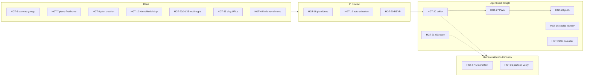
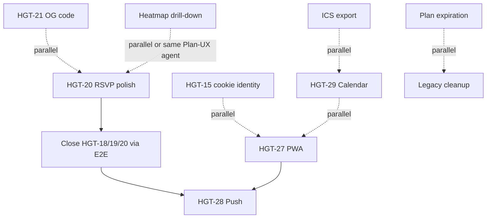

# Hangout MVP — Multi-Agent Plan (Agent-Executable)

> **Waves 0–3 complete as of May 28, 2026. Wave 4 deferred.**  
> **Post-sync (same session):** HGT-28 push permission UX — `PushNotificationPrompt`, `/api/push/watches`, httpOnly plan cookie fix.

> **Temporary doc** — remove when MVP work is complete.  
> **Last updated:** May 28, 2026  
> **Scope:** Agent-executable work only. Human validation (HGT-17, platform OG checks, real-device testing) is deferred to tomorrow.

**Sources:** [PRODUCT.md](./PRODUCT.md), [GOALS.md](./GOALS.md), [README.md](./README.md) (Linear sync at commit `284cb7a`), [audits/051126_phase3_analysis.md](./audits/051126_phase3_analysis.md), codebase verification.

**Linear board:** [linear.app/hangout-friends](https://linear.app/hangout-friends) — reconcile issue states before dispatching agents.

---

## MVP Definition

Per PRODUCT.md “v1 done,” the product is release-ready when all criteria below are met. **Tonight’s agents own the code columns; tomorrow’s session owns validation.**

| Criterion | Code status | Agent work (tonight) | Human validation (tomorrow) |
|-----------|-------------|----------------------|----------------------------|
| Stranger responds via link in <30s, no account | Shell shipped (HGT-6/10/23–25/35/44) | HGT-20 polish, heatmap drill-down, cookie identity | **HGT-17** — 5-friend Safari teardown |
| Rich link previews (iMessage + 2 platforms) | Built | HGT-21 code: fix OG metadata, scheduled-state copy | Send links in iMessage, WhatsApp, Discord, Slack |
| Full plan loop: availability → ideas → schedule → RSVP | E2E passes (`npm run test:plan-loop`) | HGT-20 polish; close In Review items via automated tests | Manual walkthrough of scheduled plan + RSVP |
| PWA install + 3 push notification types | Not started | HGT-27 + HGT-28 | Install on real iPhone/Android |
| Google Calendar read-only pre-fill | Broken stub | HGT-29/34 rewrite | OAuth flow on prod with test account |
| Auto-schedule sensible 90%+ | Algorithm in `lib/pollSchedule.ts` | HGT-22 optional | Real-plan sanity check during HGT-17 |
| Real usage (M1) | N/A | Out of scope | Friend group runs 3 hangouts unprompted |

**Explicitly NOT in MVP:** pod expansion, iMessage extension, group chat, social feed, AI scheduling, ROADMAP weather/maps polish.

---

## Current Board Snapshot

---

## Priority Tiers (agent-executable only)

### P0 — Do first tonight

| ID | Title | Why | Primary files |
|----|-------|-----|---------------|
| **HGT-20 polish** | RSVP name lists, self-state, “who’s coming” | Closes plan lifecycle UX; unblocks moving HGT-18/19/20 out of In Review | `app/polls/[id]/PollPageClient.tsx` |
| **Close HGT-18/19/20** | Automated verification + any code gaps found | E2E must pass cleanly | Run `npm run verify:021` + `npm run test:plan-loop` |

### P1 — MVP must-ship (PRODUCT.md core)

| ID | Title | Depends on | Parallel-safe |
|----|-------|------------|---------------|
| **HGT-21 (code only)** | Fix OG metadata; add scheduled-state title/subtitle/RSVP count | None | Yes — `app/api/og/route.tsx`, `app/p/[slug]/page.tsx` |
| **Heatmap drill-down** | Tap cell → who’s free; optional 80%+ toggle (PRODUCT #3) | Coordinate with HGT-20 on `PollPageClient.tsx` | Partial — `PollGrid.tsx`, `PollPageClient.tsx` |
| **HGT-27** | PWA manifest, icons, install prompt | None | Yes — `public/`, `app/layout.tsx` |
| **HGT-28** | 3 notification types + allowlist | HGT-27 (service worker) | Sequential after HGT-27 |
| **HGT-15** | Per-plan cookie identity (replace `localStorage` `poll_name`) | None | Yes — respond API + new `lib/planIdentity.ts` |
| **HGT-29/34** | Google Calendar OAuth rewrite | GCP env vars in Vercel prod | Yes — `app/api/google/*`, `lib/googleCalendar.ts` |
| **Plan expiration** | Cron on `expires_at` (30-day archive) | None | Yes — migration 022 + Vercel cron route |
| **ICS export** | One-shot “Add to calendar” on scheduled plans | None | Yes — new API route; coordinate PollPageClient with Plan-UX agent |

### P2 — Polish / reduce debt (parallel when P1 agents idle)

| Item | Notes |
|------|-------|
| **HGT-22** | Top 3 auto-schedule candidates — optional polish |
| **Legacy cleanup** | Delete orphaned `IdeasBoard.tsx`, `EventsList.tsx`, `CreateEventForm.tsx`, unused deps (`react-big-calendar`, `@chakra-ui/react`); keep pod APIs |
| **HGT-11/13** | Email + magic link auth (after cookie identity) |
| **Admin plan moderation** | Remove participant/idea on plan — `app/admin/` |
| **PRODUCT.md update** | Document weather/commute in auto-schedule section |

### P3 — Post-MVP (freeze)

- ROADMAP: Maps on plan ideas, weather badges, swipe gestures, built-in calendar view
- Pod feature expansion
- Anonymous → account migration (PRODUCT #9b)
- Plan password protection (optional)

---

## Deferred to Tomorrow (human validation — not agent work tonight)

| Item | What to do |
|------|------------|
| **HGT-17** | 5-friend mobile Safari cold test: send `/p/[slug]` link, observe without helping, file bugs |
| **HGT-21 verify** | Drop plan links in iMessage, WhatsApp, Discord, Slack; screenshot/fix any preview failures |
| **HGT-18/19/20 sign-off** | Manual walkthrough of full plan loop on a phone after tonight’s polish lands |
| **HGT-27/28 device test** | Add-to-home-screen + push on real iPhone and Android |
| **HGT-29/34 OAuth test** | Connect Google Calendar on prod with a test account |
| **GOALS M1** | One friend group, 3 unprompted hangouts — starts after code + HGT-17 pass |

---

## Multi-Agent Execution Model

### Coordination rules

1. **One migration number per agent.** Coordinator pre-assigns: `022` expiration, `023` push_subscriptions, etc.
2. **File ownership per wave** — only one agent edits a hot file per wave:
   - `PollPageClient.tsx` — single **Plan-UX agent** per wave
   - `app/layout.tsx` — PWA agent only
   - `context/UserContext.tsx` — Identity agent only
3. **Done when:** `npm run build` passes (includes migrations + types).
4. **Automated checks:** `npm run verify:021` and `npm run test:plan-loop` (dev server + Supabase env required).
5. **Pod surface is frozen** — no new pod features; bugfixes only if blocking.
6. **Branch strategy:** one branch per agent (`agent/hgt-21-og`, etc.); merge in wave order below.

### Dependency graph (agent work only)

---

## Wave Plan

### Wave 0 — Start immediately (3 agents parallel)

| Agent | Scope | Primary files | Linear |
|-------|-------|---------------|--------|
| **OG-Agent** | Fix OG image dimensions/copy; add scheduled-state metadata (time, RSVP count) | `app/api/og/route.tsx`, `app/p/[slug]/page.tsx` | HGT-21 (code) |
| **Cleanup-Agent** | Remove dead components + unused npm deps | `components/IdeasBoard.tsx`, `EventsList.tsx`, `CreateEventForm.tsx`, `package.json` | New ticket |
| **Docs-Agent** | Update PRODUCT.md auto-schedule section (weather/commute) | `docs/PRODUCT.md` | New ticket |

### Wave 1 — Plan loop polish (1 agent, or 2 sequential)

| Agent | Scope | Primary files | Linear |
|-------|-------|---------------|--------|
| **Plan-UX-Agent** | HGT-20 RSVP polish **then** heatmap drill-down (same file ownership) | `PollPageClient.tsx`, `PollGrid.tsx`, possibly `app/api/polls/[id]/route.ts` | HGT-20 + new ticket |

After Wave 1: run `npm run verify:021` + `npm run test:plan-loop`; move HGT-18/19/20 to Done if green.

### Wave 2 — Distribution & identity (4 agents parallel)

| Agent | Scope | Primary files | Linear |
|-------|-------|---------------|--------|
| **PWA-Agent** | `manifest.json`, icons, apple-mobile-web-app meta, gentle install prompt after 2nd plan visit | `public/`, `app/layout.tsx` | HGT-27 |
| **Cookie-Agent** | Plan-scoped httpOnly cookie for respondent identity | `app/api/polls/[id]/respond/route.ts`, `lib/planIdentity.ts` (new), `PollPageClient.tsx` | HGT-15 |
| **Expire-Agent** | Migration 022 + Vercel cron soft-archive expired plans | `migrations/`, `app/api/cron/expire-plans/route.ts` | New ticket |
| **Calendar-Agent** | Greenfield OAuth: `/api/google/auth`, `/api/google/callback`, rewrite `lib/googleCalendar.ts` | `app/api/google/*`, `lib/googleCalendar.ts`, profile UI | HGT-29/34 |

**Calendar-Agent prerequisite:** GCP OAuth client + `GOOGLE_CLIENT_ID` / `GOOGLE_CLIENT_SECRET` in Vercel Production (see [README.md](./README.md)).

### Wave 3 — Notifications (sequential on PWA)

| Agent | Scope | Primary files | Linear |
|-------|-------|---------------|--------|
| **Push-Agent** | Migration 023 `push_subscriptions`; service worker; allowlisted dispatcher for exactly 3 events | `public/sw.js`, `app/api/push/*` | HGT-28 |

Wire triggers in:
- `app/api/polls/[id]/respond/route.ts` → notify plan creator
- `app/api/polls/[id]/schedule/route.ts` → notify participants
- Cron route → events happening tomorrow

### Wave 4 — Auth & export (3 agents parallel)

| Agent | Scope | Linear |
|-------|-------|--------|
| **Auth-Agent** | Email + magic link routes; reduce global NameModal footprint | HGT-11/13 |
| **ICS-Agent** | `GET /api/polls/[id]/ics` + download button on scheduled plan | New ticket |
| **Schedule-UX-Agent** | HGT-22 top-3 candidate picker (optional) | HGT-22 |

---

## Sprint Mapping

| Sprint | Goal | Status |
|--------|------|--------|
| **Sprint 0** | Link-first shell | **Done** (HGT-6/7/8/10/23–26/35/44) |
| **Sprint 1** | Plan lifecycle code | **In Review** — close tonight via Wave 1 + E2E |
| **Sprint 2** | Distribution + identity | Tonight: HGT-21 code, heatmap, HGT-27/28/15/29, expiration |
| **Sprint 3** | Auth + export | Tonight Wave 4 if capacity; else next session |
| **Sprint 4** | Human validation | **Tomorrow:** HGT-17, platform OG verify, device PWA/push test |
| **Sprint 5** | MVP release | After Sprint 4 passes + GOALS M1 begins |

---

## Agent Prompt Template (for next step — after you approve this doc)

Each agent prompt will include:
- **Goal** + Linear ID
- **Read first:** `docs/PRODUCT.md` relevant section, `CLAUDE.md` constraints
- **Files allowed to edit** (explicit allowlist)
- **Files forbidden** (pod tabs, unrelated routes)
- **Done when:** bullet criteria + `npm run build` passes + relevant automated test
- **Mobile check:** describe expected behavior on 5.5" viewport
- **Do not:** add dependencies, expand auth footprint beyond scope, add notification types beyond 3

---

## Risk Register

| Risk | Mitigation |
|------|------------|
| Multiple agents edit `PollPageClient.tsx` | Single Plan-UX-Agent owns it per wave |
| Calendar OAuth blocked on GCP | Ship without HGT-29; ICS export still adds calendar value |
| Cookie + Plan-UX both touch respond flow | Cookie-Agent lands first, or Plan-UX merges after Cookie-Agent |
| Audit docs stale vs code | Trust codebase + `docs/README.md` over May 11 audits |
| Human validation tomorrow finds link-flow bugs | Pause new features; fix agents triage HGT-17 bugs first |

---

## Recommended First Dispatch (after you approve this doc)

**Wave 0 — 3 agents in parallel:**
1. **OG-Agent** → HGT-21 (code only)
2. **Cleanup-Agent** → dead code removal
3. **Docs-Agent** → PRODUCT.md auto-schedule update

**Wave 1 — 1 agent:**
4. **Plan-UX-Agent** → HGT-20 polish + heatmap drill-down (sequential, exclusive `PollPageClient.tsx`)

**Wave 2 — up to 4 agents in parallel:**
5. **PWA-Agent** → HGT-27  
6. **Cookie-Agent** → HGT-15  
7. **Expire-Agent** → plan expiration cron  
8. **Calendar-Agent** → HGT-29/34  

**Wave 3 — 1 agent (after PWA merges):**
9. **Push-Agent** → HGT-28

**Tomorrow (you, not agents):**
10. **HGT-17** + platform OG verification + device PWA/push smoke test

---

## How to run multi-agent (coordinator)

Copy-paste is the core workflow, with a few rules:

1. **One prompt → one Cursor agent chat.** Same-wave agents with disjoint files can run **in parallel**.
2. **Waves are sequential.** Finish Wave 0 before Wave 1; finish Wave 1 before Wave 2 Cookie-Agent; finish PWA before Push-Agent.
3. **You reconcile between waves** — run `npm run build`. Agents do not need to commit unless you ask them to.
4. **File conflicts:** Only one agent may edit `PollPageClient.tsx` per wave (Plan-UX in Wave 1; Cookie-Agent in Wave 2 after merge).
5. **Migration numbers:** Expire-Agent = `022`, Push-Agent = `023` — pre-assigned, do not duplicate.

Full copy-paste prompts: **[MVP_AGENT_PROMPTS.md](./MVP_AGENT_PROMPTS.md)**
